# Introduction

## Objective

The purpose of this document is to explain how to create a movie
recommendation system using the MovieLens dataset. During the PH125.8x:
Data Science: Machine Learning course, the dataset used was from the the
dslabs package. For this exercise, we will use a 10M rows dataset
available here :

> <https://grouplens.org/datasets/movielens/10m/>

The history and context of this dataset are available here :

> F. Maxwell Harper and Joseph A. Konstan. 2015. The MovieLens Datasets:
> History and Context. ACM Transactions on Interactive Intelligent
> Systems (TiiS) 5, 4, Article 19 (December 2015), 19 pages.
> DOI=<http://dx.doi.org/10.1145/2827872>

First we will setup the environment and download and generate the
dataset, then we will analyse the data, and finally we will train a
machine learning algorithm using the inputs in the first subset (edx) to
predict the movie ratings in the validation set (final\_holdout\_test).

The goal of this exercise is to be able to predict the movie ratings in
the test set with a root mean square error (RMSE) lower than
**0.86490**.

This task is inspired by the Netflix challenge, which aimed to predict
ratings without utilizing any user data (such as age or gender) due to
privacy concerns. Ultimately, the goal is to predict which films a user
would enjoy based on their previous ratings.

## Data preparation

This section explains how the data is imported and prepared for further
analysis. A portion of the process is based on the code provided in the
course, specifically within the “01 Setup.R” script.

The code processes the MovieLens 10M dataset to create training (edx)
and testing (final\_holdout\_test) datasets suitable for analysis.

It begins by checking for necessary libraries, downloading the dataset,
and extracting the ratings and movies files if they aren’t already
present. It reads and cleans the data, ensuring that columns are
correctly formatted.

The main dataset is created by merging ratings with movie details, and
then a random subset is taken as a test set—10% of the data. To maintain
consistency, only those users and movies present in the training set are
included in the final test set. Any excluded rows are then added back to
the training set. Finally, the code cleans up by removing unnecessary
variables.

# Exploratory Data Analysis

## Structure

This section provides an overview of the datasets used in our analysis.
We have two datasets: one for training our prediction algorithm and
another for testing its effectiveness.

The training dataset, edx, shares the same structure as the
final\_holdout\_test dataset, which is used for testing.

The edx dataset contains approximately 9 million ratings for various
movies and consists of six variables :

<table class="table" style="font-size: 9px; margin-left: auto; margin-right: auto;">
<thead>
<tr>
<th style="text-align:left;">
</th>
<th style="text-align:left;">
userId
</th>
<th style="text-align:left;">
movieId
</th>
<th style="text-align:left;">
rating
</th>
<th style="text-align:left;">
timestamp
</th>
<th style="text-align:left;">
title
</th>
<th style="text-align:left;">
genres
</th>
</tr>
</thead>
<tbody>
<tr>
<td style="text-align:left;">
</td>
<td style="text-align:left;">
Min. : 1
</td>
<td style="text-align:left;">
Min. : 1
</td>
<td style="text-align:left;">
Min. :0.500
</td>
<td style="text-align:left;">
Min. :7.897e+08
</td>
<td style="text-align:left;">
Length:9000055
</td>
<td style="text-align:left;">
Length:9000055
</td>
</tr>
<tr>
<td style="text-align:left;">
</td>
<td style="text-align:left;">
1st Qu.:18124
</td>
<td style="text-align:left;">
1st Qu.: 648
</td>
<td style="text-align:left;">
1st Qu.:3.000
</td>
<td style="text-align:left;">
1st Qu.:9.468e+08
</td>
<td style="text-align:left;">
Class :character
</td>
<td style="text-align:left;">
Class :character
</td>
</tr>
<tr>
<td style="text-align:left;">
</td>
<td style="text-align:left;">
Median :35738
</td>
<td style="text-align:left;">
Median : 1834
</td>
<td style="text-align:left;">
Median :4.000
</td>
<td style="text-align:left;">
Median :1.035e+09
</td>
<td style="text-align:left;">
Mode :character
</td>
<td style="text-align:left;">
Mode :character
</td>
</tr>
<tr>
<td style="text-align:left;">
</td>
<td style="text-align:left;">
Mean :35870
</td>
<td style="text-align:left;">
Mean : 4122
</td>
<td style="text-align:left;">
Mean :3.512
</td>
<td style="text-align:left;">
Mean :1.033e+09
</td>
<td style="text-align:left;">
NA
</td>
<td style="text-align:left;">
NA
</td>
</tr>
<tr>
<td style="text-align:left;">
</td>
<td style="text-align:left;">
3rd Qu.:53607
</td>
<td style="text-align:left;">
3rd Qu.: 3626
</td>
<td style="text-align:left;">
3rd Qu.:4.000
</td>
<td style="text-align:left;">
3rd Qu.:1.127e+09
</td>
<td style="text-align:left;">
NA
</td>
<td style="text-align:left;">
NA
</td>
</tr>
<tr>
<td style="text-align:left;">
</td>
<td style="text-align:left;">
Max. :71567
</td>
<td style="text-align:left;">
Max. :65133
</td>
<td style="text-align:left;">
Max. :5.000
</td>
<td style="text-align:left;">
Max. :1.231e+09
</td>
<td style="text-align:left;">
NA
</td>
<td style="text-align:left;">
NA
</td>
</tr>
</tbody>
</table>

The table below outlines the variables present in the dataset :

<table>
<colgroup>
<col style="width: 27%" />
<col style="width: 72%" />
</colgroup>
<thead>
<tr class="header">
<th>Variable</th>
<th>Description</th>
</tr>
</thead>
<tbody>
<tr class="odd">
<td><code>userId</code></td>
<td>User ID (anonymised)</td>
</tr>
<tr class="even">
<td><code>movieId</code></td>
<td>Unique movie ID</td>
</tr>
<tr class="odd">
<td><code>rating</code></td>
<td>Rating from 0 to 5 including half numbers (1.5, 2.5…)</td>
</tr>
<tr class="even">
<td><code>timestamp</code></td>
<td>Date and time the rating was created. It is stored as a number of
seconds since the 1st of January 1970</td>
</tr>
<tr class="odd">
<td><code>title</code></td>
<td>Title of the movie with the year it was released, in the form “name
(year)”</td>
</tr>
<tr class="even">
<td><code>genres</code></td>
<td>Genre of the movie (action, drama…)</td>
</tr>
</tbody>
</table>

From the dataset, we can determine the total counts of movies, users,
and ratings :

<table class="table" style="width: auto !important; margin-left: auto; margin-right: auto;">
<thead>
<tr>
<th style="text-align:left;background-color: gray!20 !important;">
Dataset
</th>
<th style="text-align:left;background-color: gray!20 !important;">
Type
</th>
<th style="text-align:left;background-color: gray!20 !important;">
Movies
</th>
<th style="text-align:left;background-color: gray!20 !important;">
Users
</th>
<th style="text-align:left;background-color: gray!20 !important;">
Ratings
</th>
</tr>
</thead>
<tbody>
<tr>
<td style="text-align:left;">
edx
</td>
<td style="text-align:left;">
Train
</td>
<td style="text-align:left;">
10,677
</td>
<td style="text-align:left;">
69,878
</td>
<td style="text-align:left;">
9,000,055
</td>
</tr>
<tr>
<td style="text-align:left;">
final\_holdout\_test
</td>
<td style="text-align:left;">
Test
</td>
<td style="text-align:left;">
9,809
</td>
<td style="text-align:left;">
68,534
</td>
<td style="text-align:left;">
999,999
</td>
</tr>
</tbody>
</table>

The analysis reveals that approximately 10,000 movies were rated by
70,000 users, resulting in a total of 9,000,000 ratings.

The pair (movieId, userId) can be used as a primary key, as each user
has rated a specific movie only once :

<table class="table" style="width: auto !important; margin-left: auto; margin-right: auto;">
<thead>
<tr>
<th style="text-align:left;background-color: gray!20 !important;">
Dataset
</th>
<th style="text-align:left;background-color: gray!20 !important;">
(movieId, userId)
</th>
<th style="text-align:left;background-color: gray!20 !important;">
Ratings
</th>
</tr>
</thead>
<tbody>
<tr>
<td style="text-align:left;">
edx
</td>
<td style="text-align:left;">
9,000,055
</td>
<td style="text-align:left;">
9,000,055
</td>
</tr>
<tr>
<td style="text-align:left;">
final\_holdout\_test
</td>
<td style="text-align:left;">
999,999
</td>
<td style="text-align:left;">
999,999
</td>
</tr>
<tr>
<td style="text-align:left;">
Overlap
</td>
<td style="text-align:left;">
0
</td>
<td style="text-align:left;">
</td>
</tr>
</tbody>
</table>

We can also observe that a rating given by a user for a specific movie
cannot appear in both the training and test datasets.

## Data Transformation

The first few entries of the edx dataset suggest potential
transformations for enhanced analysis :

<table class="table" style="font-size: 9px; margin-left: auto; margin-right: auto;">
<thead>
<tr>
<th style="text-align:left;">
</th>
<th style="text-align:right;">
userId
</th>
<th style="text-align:right;">
movieId
</th>
<th style="text-align:right;">
rating
</th>
<th style="text-align:right;">
timestamp
</th>
<th style="text-align:left;">
title
</th>
<th style="text-align:left;">
genres
</th>
</tr>
</thead>
<tbody>
<tr>
<td style="text-align:left;">
1
</td>
<td style="text-align:right;">
1
</td>
<td style="text-align:right;">
122
</td>
<td style="text-align:right;">
5
</td>
<td style="text-align:right;">
838985046
</td>
<td style="text-align:left;">
Boomerang (1992)
</td>
<td style="text-align:left;">
Comedy;Romance
</td>
</tr>
<tr>
<td style="text-align:left;">
2
</td>
<td style="text-align:right;">
1
</td>
<td style="text-align:right;">
185
</td>
<td style="text-align:right;">
5
</td>
<td style="text-align:right;">
838983525
</td>
<td style="text-align:left;">
Net, The (1995)
</td>
<td style="text-align:left;">
Action;Crime;Thriller
</td>
</tr>
<tr>
<td style="text-align:left;">
4
</td>
<td style="text-align:right;">
1
</td>
<td style="text-align:right;">
292
</td>
<td style="text-align:right;">
5
</td>
<td style="text-align:right;">
838983421
</td>
<td style="text-align:left;">
Outbreak (1995)
</td>
<td style="text-align:left;">
Action;Drama;Sci-Fi;Thriller
</td>
</tr>
<tr>
<td style="text-align:left;">
5
</td>
<td style="text-align:right;">
1
</td>
<td style="text-align:right;">
316
</td>
<td style="text-align:right;">
5
</td>
<td style="text-align:right;">
838983392
</td>
<td style="text-align:left;">
Stargate (1994)
</td>
<td style="text-align:left;">
Action;Adventure;Sci-Fi
</td>
</tr>
<tr>
<td style="text-align:left;">
6
</td>
<td style="text-align:right;">
1
</td>
<td style="text-align:right;">
329
</td>
<td style="text-align:right;">
5
</td>
<td style="text-align:right;">
838983392
</td>
<td style="text-align:left;">
Star Trek: Generations (1994)
</td>
<td style="text-align:left;">
Action;Adventure;Drama;Sci-Fi
</td>
</tr>
<tr>
<td style="text-align:left;">
7
</td>
<td style="text-align:right;">
1
</td>
<td style="text-align:right;">
355
</td>
<td style="text-align:right;">
5
</td>
<td style="text-align:right;">
838984474
</td>
<td style="text-align:left;">
Flintstones, The (1994)
</td>
<td style="text-align:left;">
Children;Comedy;Fantasy
</td>
</tr>
</tbody>
</table>

The timestamp variable can be decomposed into various components,
including the day of the week, day, month, year, and hour (minutes and
seconds are likely unnecessary for our analysis).

Additionally, the title variable contains the release year formatted as
“title (year).” We can extract both the title without the year and the
year of release.

While we can also separate the genres, we are not permitted to add rows
to the dataset, only columns, so this transformation is not feasible.

The table below displays the modified edx dataset, which retains the
genres column but omits it from this view due to space constraints :

<table class="table" style="font-size: 9px; margin-left: auto; margin-right: auto;">
<thead>
<tr>
<th style="text-align:right;">
userId
</th>
<th style="text-align:right;">
movieId
</th>
<th style="text-align:right;">
rating
</th>
<th style="text-align:right;">
t\_day\_of\_week
</th>
<th style="text-align:right;">
t\_day
</th>
<th style="text-align:right;">
t\_month
</th>
<th style="text-align:right;">
t\_year
</th>
<th style="text-align:right;">
t\_hour
</th>
<th style="text-align:left;">
title
</th>
<th style="text-align:right;">
year
</th>
</tr>
</thead>
<tbody>
<tr>
<td style="text-align:right;">
1
</td>
<td style="text-align:right;">
122
</td>
<td style="text-align:right;">
5
</td>
<td style="text-align:right;">
5
</td>
<td style="text-align:right;">
2
</td>
<td style="text-align:right;">
8
</td>
<td style="text-align:right;">
1996
</td>
<td style="text-align:right;">
11
</td>
<td style="text-align:left;">
Boomerang
</td>
<td style="text-align:right;">
1992
</td>
</tr>
<tr>
<td style="text-align:right;">
1
</td>
<td style="text-align:right;">
185
</td>
<td style="text-align:right;">
5
</td>
<td style="text-align:right;">
5
</td>
<td style="text-align:right;">
2
</td>
<td style="text-align:right;">
8
</td>
<td style="text-align:right;">
1996
</td>
<td style="text-align:right;">
10
</td>
<td style="text-align:left;">
Net, The
</td>
<td style="text-align:right;">
1995
</td>
</tr>
<tr>
<td style="text-align:right;">
1
</td>
<td style="text-align:right;">
292
</td>
<td style="text-align:right;">
5
</td>
<td style="text-align:right;">
5
</td>
<td style="text-align:right;">
2
</td>
<td style="text-align:right;">
8
</td>
<td style="text-align:right;">
1996
</td>
<td style="text-align:right;">
10
</td>
<td style="text-align:left;">
Outbreak
</td>
<td style="text-align:right;">
1995
</td>
</tr>
<tr>
<td style="text-align:right;">
1
</td>
<td style="text-align:right;">
316
</td>
<td style="text-align:right;">
5
</td>
<td style="text-align:right;">
5
</td>
<td style="text-align:right;">
2
</td>
<td style="text-align:right;">
8
</td>
<td style="text-align:right;">
1996
</td>
<td style="text-align:right;">
10
</td>
<td style="text-align:left;">
Stargate
</td>
<td style="text-align:right;">
1994
</td>
</tr>
<tr>
<td style="text-align:right;">
1
</td>
<td style="text-align:right;">
329
</td>
<td style="text-align:right;">
5
</td>
<td style="text-align:right;">
5
</td>
<td style="text-align:right;">
2
</td>
<td style="text-align:right;">
8
</td>
<td style="text-align:right;">
1996
</td>
<td style="text-align:right;">
10
</td>
<td style="text-align:left;">
Star Trek: Generations
</td>
<td style="text-align:right;">
1994
</td>
</tr>
<tr>
<td style="text-align:right;">
1
</td>
<td style="text-align:right;">
355
</td>
<td style="text-align:right;">
5
</td>
<td style="text-align:right;">
5
</td>
<td style="text-align:right;">
2
</td>
<td style="text-align:right;">
8
</td>
<td style="text-align:right;">
1996
</td>
<td style="text-align:right;">
11
</td>
<td style="text-align:left;">
Flintstones, The
</td>
<td style="text-align:right;">
1994
</td>
</tr>
</tbody>
</table>

This allows us to focus on the other relevant attributes for analysis
while keeping the genres information in the dataset.

## Data Analysis

### Movies

The top five movies with the highest number of ratings each received
30,000 ratings, indicating that half of the users rated these films :

<table class="table" style="width: auto !important; margin-left: auto; margin-right: auto;">
<thead>
<tr>
<th style="text-align:right;background-color: gray!20 !important;padding: 0;">
index
</th>
<th style="text-align:left;background-color: gray!20 !important;padding: 0;">
title
</th>
<th style="text-align:left;background-color: gray!20 !important;padding: 0;">
year
</th>
<th style="text-align:right;background-color: gray!20 !important;padding: 0;">
count
</th>
</tr>
</thead>
<tbody>
<tr>
<td style="text-align:right;">
1
</td>
<td style="text-align:left;">
Pulp Fiction
</td>
<td style="text-align:left;">
1994
</td>
<td style="text-align:right;">
31,362
</td>
</tr>
<tr>
<td style="text-align:right;">
2
</td>
<td style="text-align:left;">
Forrest Gump
</td>
<td style="text-align:left;">
1994
</td>
<td style="text-align:right;">
31,079
</td>
</tr>
<tr>
<td style="text-align:right;">
3
</td>
<td style="text-align:left;">
Silence of the Lambs, The
</td>
<td style="text-align:left;">
1991
</td>
<td style="text-align:right;">
30,382
</td>
</tr>
<tr>
<td style="text-align:right;">
4
</td>
<td style="text-align:left;">
Jurassic Park
</td>
<td style="text-align:left;">
1993
</td>
<td style="text-align:right;">
29,360
</td>
</tr>
<tr>
<td style="text-align:right;">
5
</td>
<td style="text-align:left;">
Shawshank Redemption, The
</td>
<td style="text-align:left;">
1994
</td>
<td style="text-align:right;">
28,015
</td>
</tr>
</tbody>
</table>

### Movie Ratings Visualization

The left figure illustrates that a small number of movies received the
majority of ratings, while most received very few.

To better highlight this trend, we can apply a log10 transformation to
the y-axis. This transformation reveals that although most movies
garnered at least 10 ratings, only half exceeded 100 ratings, as
demonstrated in the right figure :

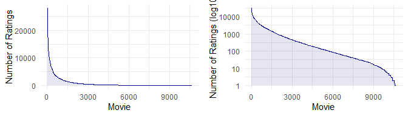

Number of ratings / Movie

### Movie Release and Ratings Trends

The figure on the left shows that the number of movies released per year
increased significantly during the 1980s.

Similarly, the figure on the right demonstrates that the number of
ratings received per year for newly released movies also rose during
this period. However, it appears that older movies received
significantly fewer ratings compared to more recent releases :

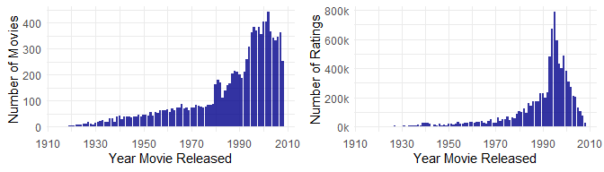

Number of Movies Released per Year and Number of Ratings per Year

### Users

As previously mentioned, the edx dataset contains approximately 70,000
users. Below are the top five users with the highest number of ratings :

<table class="table" style="width: auto !important; margin-left: auto; margin-right: auto;">
<thead>
<tr>
<th style="text-align:right;">
index
</th>
<th style="text-align:right;">
count
</th>
</tr>
</thead>
<tbody>
<tr>
<td style="text-align:right;">
1
</td>
<td style="text-align:right;">
6,616
</td>
</tr>
<tr>
<td style="text-align:right;">
2
</td>
<td style="text-align:right;">
6,360
</td>
</tr>
<tr>
<td style="text-align:right;">
3
</td>
<td style="text-align:right;">
4,648
</td>
</tr>
<tr>
<td style="text-align:right;">
4
</td>
<td style="text-align:right;">
4,036
</td>
</tr>
<tr>
<td style="text-align:right;">
5
</td>
<td style="text-align:right;">
4,023
</td>
</tr>
</tbody>
</table>

A small number of users account for a large proportion of ratings, as
shown in the figure on the left, which illustrates that the majority of
ratings come from a minority of users.

By applying a log10 transformation to the y-axis, we can see that all
users rated at least 10 movies, while only one-third rated more than 100
movies, as depicted in the figure on the right :

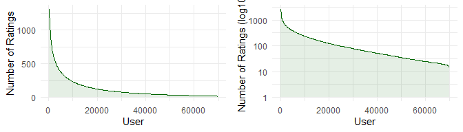

Number of ratings / User

### Ratings

The figures below demonstrate that the distribution of ratings can be
approximated as normal when rounded :

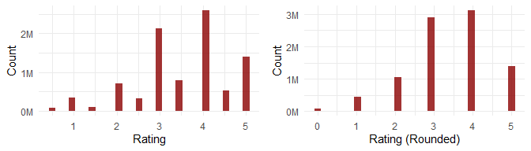

Number of ratings

The table below displays the average and standard deviation :

<table class="table" style="width: auto !important; margin-left: auto; margin-right: auto;">
<thead>
<tr>
<th style="text-align:left;">
Type
</th>
<th style="text-align:right;">
Value
</th>
</tr>
</thead>
<tbody>
<tr>
<td style="text-align:left;">
Average
</td>
<td style="text-align:right;">
3.512465
</td>
</tr>
<tr>
<td style="text-align:left;">
Standard Deviation
</td>
<td style="text-align:right;">
1.060331
</td>
</tr>
</tbody>
</table>

### Variables

List of variables and their distinct value counts :

<table class="table" style="margin-left: auto; margin-right: auto;">
<thead>
<tr>
<th style="text-align:left;">
Variable
</th>
<th style="text-align:right;">
Distinct\_Count
</th>
</tr>
</thead>
<tbody>
<tr>
<td style="text-align:left;">
userId
</td>
<td style="text-align:right;">
69,878
</td>
</tr>
<tr>
<td style="text-align:left;">
movieId
</td>
<td style="text-align:right;">
10,677
</td>
</tr>
<tr>
<td style="text-align:left;">
title
</td>
<td style="text-align:right;">
10,407
</td>
</tr>
<tr>
<td style="text-align:left;">
genres
</td>
<td style="text-align:right;">
797
</td>
</tr>
<tr>
<td style="text-align:left;">
year
</td>
<td style="text-align:right;">
94
</td>
</tr>
<tr>
<td style="text-align:left;">
t\_day
</td>
<td style="text-align:right;">
31
</td>
</tr>
<tr>
<td style="text-align:left;">
t\_hour
</td>
<td style="text-align:right;">
24
</td>
</tr>
<tr>
<td style="text-align:left;">
t\_year
</td>
<td style="text-align:right;">
15
</td>
</tr>
<tr>
<td style="text-align:left;">
t\_month
</td>
<td style="text-align:right;">
12
</td>
</tr>
<tr>
<td style="text-align:left;">
t\_day\_of\_week
</td>
<td style="text-align:right;">
7
</td>
</tr>
</tbody>
</table>

### Distribution of Average Ratings per Variable

We will consider only those variables that have a sufficient number of
distinct values : userId, movieId, title and genres.

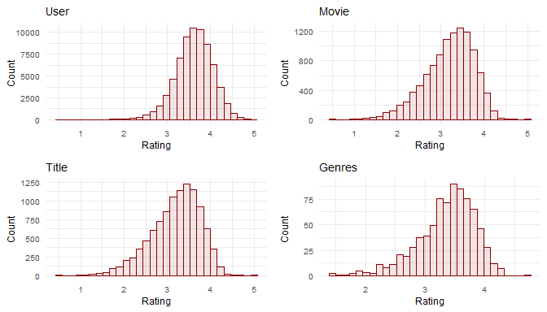

Distribution of ratings

We will now compare Title against Movie as the graphs look very similar
:

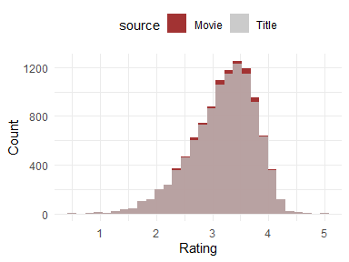

Comparison of the Distribution of ratings

For the upcoming analysis, we will focus exclusively on the movie, user,
and genres variables, which have a high number of unique values, while
excluding the title variable.

### Variables with Low Distinct Values

We will now examine variables that have a low number of distinct values,
specifically the timestamp information and the year of release.

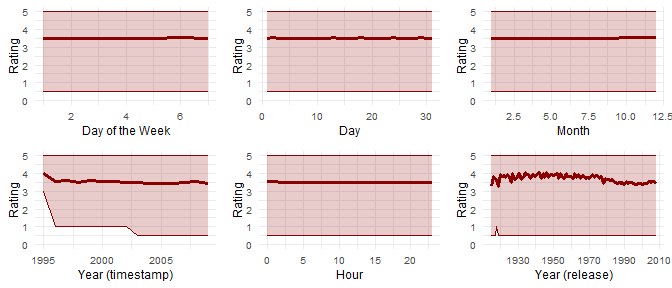

Distribution of ratings per variable

As observed, only the timestamp (year) and year of release exhibit
sufficient variation (considering both the mean and minimum values for
the timestamp) to be included in the forthcoming analysis.

# Predictions

Given the big number of ratings (9 millions) we won’t use any training
algorithm such as lm as they would require an extensive time to compute.
We will try to estimate the ratings using average and biases.

The goal of this exercise is to get the minimum root mean square error
(RMSE). The RMSE can be defined as :

where :  
*y**i* : The observed values (actual ratings).  
*ŷ**i* : The predicted values (model outputs).  
*N*: The number of observations.

## Target

The target RMSE we want to achieve (get a lower value) is : RMSE =
0.86490

## Average

The average for the predictions is : *μ* = 3.512465 If we choose a
constant number for the predictions, then *μ* will be the one which will
give the minimum RMSE :

The RMSE will then be : RMSE = 1.060331

The error can be defined as :

The following plots illustrate the distribution of ratings in descending
order, with the average value represented by a horizontal orange line.
The plot on the right depicts the distribution of errors :

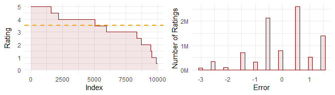

Prediction (average)

## Bias (simple)

The next step is to introduce a bias so the prediction can be written :

with :

where :  
*ŷ**i* : The predicted values for a variable v (model
outputs).  
*b**v*, *i* : The bias for a variable v.

The figure below illustrates our objective. For each movie (or user or
genre), we calculate the average rating. In this example, there are
three movies, each represented by different colors, with individual
points indicating their ratings. The line or segment displays the
average rating for each specific movie (or user or genre). The orange
line shows the global average :

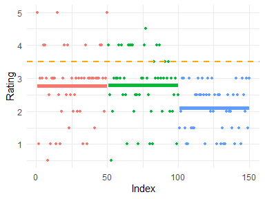

Bias

During the prediction process, we will default to the overall average
rating. We will then adjust this by adding the difference between the
average rating for each movie (or user or genre) and the global average
*μ*, with this difference representing the bias.

If the same movie (or user or genre) appears in the test dataset, we
will use its average rating. Otherwise, we will predict the global
average from the training dataset. This approach should result in a
lower RMSE.

The table below presents the RMSE values for different prediction types
used in our analysis : average and bias for Movie, User, Genres,
Year(timestamp) and Year (release).

<table class="table" style="width: auto !important; margin-left: auto; margin-right: auto;">
<thead>
<tr>
<th style="text-align:left;">
Type
</th>
<th style="text-align:right;">
RMSE
</th>
</tr>
</thead>
<tbody>
<tr>
<td style="text-align:left;">
Target
</td>
<td style="text-align:right;">
0.8649000
</td>
</tr>
<tr>
<td style="text-align:left;">
Average
</td>
<td style="text-align:right;">
1.0603313
</td>
</tr>
<tr>
<td style="text-align:left;">
Movie
</td>
<td style="text-align:right;">
0.9423475
</td>
</tr>
<tr>
<td style="text-align:left;">
User
</td>
<td style="text-align:right;">
0.9700086
</td>
</tr>
<tr>
<td style="text-align:left;">
Genres
</td>
<td style="text-align:right;">
1.0179838
</td>
</tr>
<tr>
<td style="text-align:left;">
Year (timestamp)
</td>
<td style="text-align:right;">
1.0585990
</td>
</tr>
<tr>
<td style="text-align:left;">
Year (release)
</td>
<td style="text-align:right;">
1.0493440
</td>
</tr>
</tbody>
</table>

-   **Target**: The RMSE for the target model is 0.8649000, indicating
    the maximum value of the RMSE we want to get.
-   **Average**: The baseline RMSE calculated using the global average
    is 1.0603313, which serves as a reference point.
-   **Movie**: When predictions are made based on individual movie
    averages, the RMSE is 0.9423475, showing improved accuracy compared
    to the average.
-   **User**: Prediction based on user-specific averages yields an RMSE
    of 0.9700086, which is slightly higher than the movie-based
    predictions.
-   **Genres**: Using genre averages results in an RMSE of 1.0179838,
    indicating diminished accuracy compared to both movie and user
    averages.
-   **Year (timestamp)**: The RMSE for the year based on timestamp data
    stands at 1.0585990, showing median accuracy.
-   **Year (release)**: Similarly, predictions based on the release year
    have an RMSE of 1.0493440, which also indicates average performance.

In summary, the table demonstrates that the predictions based on movies
yield the best results among the other features considered.

The following four plots illustrate the distribution of errors for the
biases associated with movies, users, genres, and the year (timestamp).
We have excluded the release year, as its RMSE is very similar to that
of the timestamp year. Ideally, we want the errors to be as close to
zero as possible. The plots clearly indicate that the timestamp year
yields the highest errors, while the genre bias performs better but
still falls short. The movie bias demonstrates the best performance,
followed closely by the user bias.

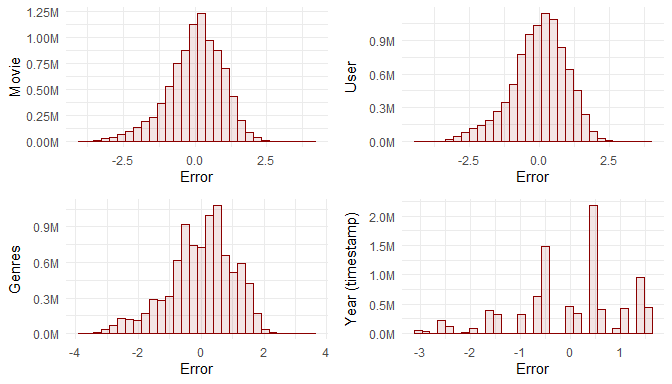

Distribution of error (Bias)

As an example, some predictions for the movie bias are shown in the
table below :

<table class="table" style="font-size: 9px; margin-left: auto; margin-right: auto;">
<thead>
<tr>
<th style="text-align:right;">
userId
</th>
<th style="text-align:right;">
movieId
</th>
<th style="text-align:left;">
title
</th>
<th style="text-align:right;">
year
</th>
<th style="text-align:right;">
rating
</th>
<th style="text-align:right;">
pred\_1
</th>
</tr>
</thead>
<tbody>
<tr>
<td style="text-align:right;">
18162
</td>
<td style="text-align:right;">
38061
</td>
<td style="text-align:left;">
Kiss Kiss Bang Bang
</td>
<td style="text-align:right;">
2005
</td>
<td style="text-align:right;">
4.5
</td>
<td style="text-align:right;">
3.882276
</td>
</tr>
<tr>
<td style="text-align:right;">
40319
</td>
<td style="text-align:right;">
5450
</td>
<td style="text-align:left;">
Lovely & Amazing
</td>
<td style="text-align:right;">
2001
</td>
<td style="text-align:right;">
4.0
</td>
<td style="text-align:right;">
3.511594
</td>
</tr>
<tr>
<td style="text-align:right;">
62284
</td>
<td style="text-align:right;">
457
</td>
<td style="text-align:left;">
Fugitive, The
</td>
<td style="text-align:right;">
1993
</td>
<td style="text-align:right;">
4.0
</td>
<td style="text-align:right;">
4.009155
</td>
</tr>
<tr>
<td style="text-align:right;">
54902
</td>
<td style="text-align:right;">
6218
</td>
<td style="text-align:left;">
Bend It Like Beckham
</td>
<td style="text-align:right;">
2002
</td>
<td style="text-align:right;">
4.0
</td>
<td style="text-align:right;">
3.673926
</td>
</tr>
<tr>
<td style="text-align:right;">
67248
</td>
<td style="text-align:right;">
356
</td>
<td style="text-align:left;">
Forrest Gump
</td>
<td style="text-align:right;">
1994
</td>
<td style="text-align:right;">
5.0
</td>
<td style="text-align:right;">
4.012822
</td>
</tr>
</tbody>
</table>

## Bias (Multiple)

The next step is to introduce a second bias so the prediction can be
written :

where :  
*ŷ**v*, *i* : The predicted values for a variable v (model
outputs).  
*b**v*, *i* : The bias for a variable v.  
*b**w*, *i* : The bias for a variable w.

We can keep the same formula (5) for the 2 biases, which will give a
better RMSE for the movie and user variables : **0.8767534**

However, we can even fine tune the calculation of the bias. If we keep
the same formula as (5) for the first bias, we can calculate the next
one with this formulas :

The first bias is defined as the difference between the overall average
and the average for a specific movie (or user or genre).

However, the definition of the second bias has changed. When the first
bias pertains to the movie, the second bias—applicable to the user—will
be the difference between the average rating for a specific user and the
average of the predicted ratings for the movies that this user has
rated.

The table below presents the RMSE values for different prediction types
used in our analysis : average and bias for Movie, and the multiple
biases applied to Movie and User, and all variables : Movie, User,
Genres, Year(timestamp) and Year (release).

<table class="table" style="width: auto !important; margin-left: auto; margin-right: auto;">
<thead>
<tr>
<th style="text-align:left;">
Type
</th>
<th style="text-align:right;">
RMSE
</th>
</tr>
</thead>
<tbody>
<tr>
<td style="text-align:left;">
Target
</td>
<td style="text-align:right;">
0.8649000
</td>
</tr>
<tr>
<td style="text-align:left;">
Average
</td>
<td style="text-align:right;">
1.0603313
</td>
</tr>
<tr>
<td style="text-align:left;">
Movie
</td>
<td style="text-align:right;">
0.9423475
</td>
</tr>
<tr>
<td style="text-align:left;">
Movie + User
</td>
<td style="text-align:right;">
0.8567039
</td>
</tr>
<tr>
<td style="text-align:left;">
All
</td>
<td style="text-align:right;">
0.8561090
</td>
</tr>
</tbody>
</table>

The following plot show the distribution of errors for the Movie bias
(simple) and the Movie + User one (multiple) :

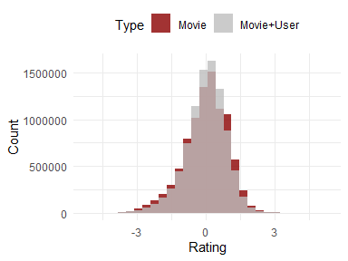

Comparison of the Distribution of ratings

As an example, some predictions for the movie and user biases are shown
in the table below :

<table class="table" style="font-size: 9px; margin-left: auto; margin-right: auto;">
<thead>
<tr>
<th style="text-align:right;">
userId
</th>
<th style="text-align:right;">
movieId
</th>
<th style="text-align:left;">
title
</th>
<th style="text-align:right;">
year
</th>
<th style="text-align:right;">
rating
</th>
<th style="text-align:right;">
pred\_1
</th>
<th style="text-align:right;">
pred\_2
</th>
</tr>
</thead>
<tbody>
<tr>
<td style="text-align:right;">
18162
</td>
<td style="text-align:right;">
38061
</td>
<td style="text-align:left;">
Kiss Kiss Bang Bang
</td>
<td style="text-align:right;">
2005
</td>
<td style="text-align:right;">
4.5
</td>
<td style="text-align:right;">
3.882276
</td>
<td style="text-align:right;">
4.360147
</td>
</tr>
<tr>
<td style="text-align:right;">
40319
</td>
<td style="text-align:right;">
5450
</td>
<td style="text-align:left;">
Lovely & Amazing
</td>
<td style="text-align:right;">
2001
</td>
<td style="text-align:right;">
4.0
</td>
<td style="text-align:right;">
3.511594
</td>
<td style="text-align:right;">
3.192117
</td>
</tr>
<tr>
<td style="text-align:right;">
62284
</td>
<td style="text-align:right;">
457
</td>
<td style="text-align:left;">
Fugitive, The
</td>
<td style="text-align:right;">
1993
</td>
<td style="text-align:right;">
4.0
</td>
<td style="text-align:right;">
4.009155
</td>
<td style="text-align:right;">
3.875513
</td>
</tr>
<tr>
<td style="text-align:right;">
54902
</td>
<td style="text-align:right;">
6218
</td>
<td style="text-align:left;">
Bend It Like Beckham
</td>
<td style="text-align:right;">
2002
</td>
<td style="text-align:right;">
4.0
</td>
<td style="text-align:right;">
3.673926
</td>
<td style="text-align:right;">
1.913689
</td>
</tr>
<tr>
<td style="text-align:right;">
67248
</td>
<td style="text-align:right;">
356
</td>
<td style="text-align:left;">
Forrest Gump
</td>
<td style="text-align:right;">
1994
</td>
<td style="text-align:right;">
5.0
</td>
<td style="text-align:right;">
4.012822
</td>
<td style="text-align:right;">
3.667569
</td>
</tr>
</tbody>
</table>

## Regularisation

Regularization adjusts the model’s bias by incorporating penalty terms
into the loss function. This adjustment helps to tune the model’s
complexity, making it more robust against overfitting. By adding
penalties to large coefficients, regularization reduces the influence of
outliers. This results in a model that doesn’t react excessively to
extreme values in the data.

The bias formulas for the movies and the users can now be written :

and :

The figure below shows how the (RMSE varies with the regularisation
parameter *λ* :

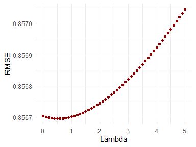

Cross‑validated RMSE vs Regularisation Strength

The minimum value is reached when *λ* = 0.5, the RMSE is then
**0.8566952**.

This result is higher than with the previous method and not really below
the Movie + User method :

<table class="table" style="width: auto !important; margin-left: auto; margin-right: auto;">
<thead>
<tr>
<th style="text-align:left;">
Type
</th>
<th style="text-align:right;">
RMSE
</th>
</tr>
</thead>
<tbody>
<tr>
<td style="text-align:left;">
Target
</td>
<td style="text-align:right;">
0.8649000
</td>
</tr>
<tr>
<td style="text-align:left;">
Average
</td>
<td style="text-align:right;">
1.0603313
</td>
</tr>
<tr>
<td style="text-align:left;">
Movie
</td>
<td style="text-align:right;">
0.9423475
</td>
</tr>
<tr>
<td style="text-align:left;">
Movie + User
</td>
<td style="text-align:right;">
0.8567039
</td>
</tr>
<tr>
<td style="text-align:left;">
All
</td>
<td style="text-align:right;">
0.8561090
</td>
</tr>
<tr>
<td style="text-align:left;">
Regularisation (Movie + User)
</td>
<td style="text-align:right;">
0.8566952
</td>
</tr>
</tbody>
</table>
## Multi-dimension bias

The idea is to use a couple of variables to calculate the bias.

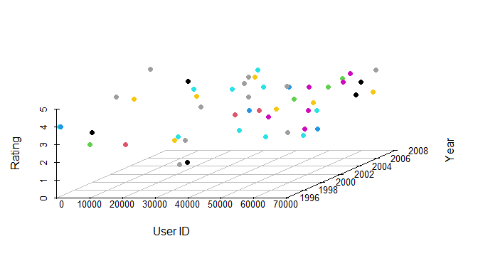

Rating per user, year (timestamp) and movie

The table below displays for each couple of variables the number of rows
in final\_holdout\_test not in the edx dataset :

<table class="table" style="width: auto !important; margin-left: auto; margin-right: auto;">
<thead>
<tr>
<th style="text-align:left;">
Combination
</th>
<th style="text-align:right;">
Nb Rows
</th>
</tr>
</thead>
<tbody>
<tr>
<td style="text-align:left;">
userId, movieId
</td>
<td style="text-align:right;">
999,999
</td>
</tr>
<tr>
<td style="text-align:left;">
userId, title
</td>
<td style="text-align:right;">
994,147
</td>
</tr>
<tr>
<td style="text-align:left;">
userId, genres
</td>
<td style="text-align:right;">
336,086
</td>
</tr>
<tr>
<td style="text-align:left;">
userId, year
</td>
<td style="text-align:right;">
73,053
</td>
</tr>
<tr>
<td style="text-align:left;">
movieId, t\_year
</td>
<td style="text-align:right;">
704
</td>
</tr>
<tr>
<td style="text-align:left;">
t\_year, title
</td>
<td style="text-align:right;">
692
</td>
</tr>
<tr>
<td style="text-align:left;">
userId, t\_year
</td>
<td style="text-align:right;">
162
</td>
</tr>
<tr>
<td style="text-align:left;">
t\_year, genres
</td>
<td style="text-align:right;">
16
</td>
</tr>
<tr>
<td style="text-align:left;">
t\_year, year
</td>
<td style="text-align:right;">
1
</td>
</tr>
<tr>
<td style="text-align:left;">
movieId, title
</td>
<td style="text-align:right;">
0
</td>
</tr>
<tr>
<td style="text-align:left;">
movieId, year
</td>
<td style="text-align:right;">
0
</td>
</tr>
<tr>
<td style="text-align:left;">
movieId, genres
</td>
<td style="text-align:right;">
0
</td>
</tr>
<tr>
<td style="text-align:left;">
title, year
</td>
<td style="text-align:right;">
0
</td>
</tr>
<tr>
<td style="text-align:left;">
title, genres
</td>
<td style="text-align:right;">
0
</td>
</tr>
<tr>
<td style="text-align:left;">
year, genres
</td>
<td style="text-align:right;">
0
</td>
</tr>
</tbody>
</table>

The more rows only in final\_holdout\_test, the better RMSE we will get
in the training set, but we will probably also get a high RMSE in the
test set.

We can even treat three variables as a triplet. The table below shows,
for each combination of these three variables, how many rows in
final\_holdout\_test are absent from the edx dataset :

<table class="table" style="width: auto !important; margin-left: auto; margin-right: auto;">
<thead>
<tr>
<th style="text-align:left;">
Combination
</th>
<th style="text-align:right;">
Nb Rows
</th>
</tr>
</thead>
<tbody>
<tr>
<td style="text-align:left;">
userId, movieId, t\_year
</td>
<td style="text-align:right;">
999,999
</td>
</tr>
<tr>
<td style="text-align:left;">
userId, movieId, title
</td>
<td style="text-align:right;">
999,999
</td>
</tr>
<tr>
<td style="text-align:left;">
userId, movieId, year
</td>
<td style="text-align:right;">
999,999
</td>
</tr>
<tr>
<td style="text-align:left;">
userId, movieId, genres
</td>
<td style="text-align:right;">
999,999
</td>
</tr>
<tr>
<td style="text-align:left;">
userId, title, year
</td>
<td style="text-align:right;">
999,996
</td>
</tr>
<tr>
<td style="text-align:left;">
userId, title, genres
</td>
<td style="text-align:right;">
998,705
</td>
</tr>
<tr>
<td style="text-align:left;">
userId, t\_year, title
</td>
<td style="text-align:right;">
995,577
</td>
</tr>
<tr>
<td style="text-align:left;">
userId, year, genres
</td>
<td style="text-align:right;">
761,808
</td>
</tr>
<tr>
<td style="text-align:left;">
userId, t\_year, genres
</td>
<td style="text-align:right;">
377,194
</td>
</tr>
<tr>
<td style="text-align:left;">
userId, t\_year, year
</td>
<td style="text-align:right;">
93,965
</td>
</tr>
<tr>
<td style="text-align:left;">
movieId, t\_year, title
</td>
<td style="text-align:right;">
704
</td>
</tr>
<tr>
<td style="text-align:left;">
movieId, t\_year, year
</td>
<td style="text-align:right;">
704
</td>
</tr>
<tr>
<td style="text-align:left;">
movieId, t\_year, genres
</td>
<td style="text-align:right;">
704
</td>
</tr>
<tr>
<td style="text-align:left;">
t\_year, title, year
</td>
<td style="text-align:right;">
704
</td>
</tr>
<tr>
<td style="text-align:left;">
t\_year, title, genres
</td>
<td style="text-align:right;">
704
</td>
</tr>
<tr>
<td style="text-align:left;">
t\_year, year, genres
</td>
<td style="text-align:right;">
188
</td>
</tr>
<tr>
<td style="text-align:left;">
movieId, title, year
</td>
<td style="text-align:right;">
0
</td>
</tr>
<tr>
<td style="text-align:left;">
movieId, title, genres
</td>
<td style="text-align:right;">
0
</td>
</tr>
<tr>
<td style="text-align:left;">
movieId, year, genres
</td>
<td style="text-align:right;">
0
</td>
</tr>
<tr>
<td style="text-align:left;">
title, year, genres
</td>
<td style="text-align:right;">
0
</td>
</tr>
</tbody>
</table>

As we saw earlier, we had the lowest RMSE by applying a bias on the
movie variable before the user one, so we will continue with the couples
(movieId, t\_year), (userId, t\_year) and then (t\_year, year, title).

To further reduce the RMSE, we will also apply a regularization with the
same value of *λ* as found earlier (0.5).

The formulas for the 3 bias will then be :

Bias Calculation :

    b_v <- edx_movies %>%
      group_by(movieId, t_year) %>%
      summarise(b_v = sum(rating - mu)/(n() + lambda))
                                    
    b_w <- edx_movies %>%
      group_by(userId, t_year) %>%
      summarise(b_w = sum(rating - mu - b_v)/(n() + lambda))
                                    
    b_x <- edx_movies %>%
      group_by(t_year, year, title) %>%
      summarise(b_x = sum(rating - mu - b_v - b_w)/(n() + lambda))

Joining the bias terms to the edx data set :

    edx_movies <- edx_movies %>%
      left_join(b_v, by = c("movieId", "t_year")) %>%
      mutate(b_v = replace_na(b_v, 0))

    edx_movies <- edx_movies %>%
      left_join(b_w, by = c("userId", "t_year")) %>%
      mutate(b_w = replace_na(b_w, 0))

    edx_movies <- edx_movies %>%
      left_join(b_x, by = c("t_year", "year", "title")) %>%
      mutate(b_x = replace_na(b_x, 0))

After incorporating the three bias components, the model achieves an
RMSE of **0.8417134** on the train set.

<table class="table" style="width: auto !important; margin-left: auto; margin-right: auto;">
<thead>
<tr>
<th style="text-align:left;">
Type
</th>
<th style="text-align:right;">
RMSE
</th>
</tr>
</thead>
<tbody>
<tr>
<td style="text-align:left;">
Target
</td>
<td style="text-align:right;">
0.8649000
</td>
</tr>
<tr>
<td style="text-align:left;">
Average
</td>
<td style="text-align:right;">
1.0603313
</td>
</tr>
<tr>
<td style="text-align:left;">
Movie
</td>
<td style="text-align:right;">
0.9423475
</td>
</tr>
<tr>
<td style="text-align:left;">
Movie + User
</td>
<td style="text-align:right;">
0.8567039
</td>
</tr>
<tr>
<td style="text-align:left;">
All
</td>
<td style="text-align:right;">
0.8561090
</td>
</tr>
<tr>
<td style="text-align:left;">
Regularisation (Movie + User)
</td>
<td style="text-align:right;">
0.8566952
</td>
</tr>
<tr>
<td style="text-align:left;">
2D/3D Interaction
</td>
<td style="text-align:right;">
0.8417134
</td>
</tr>
</tbody>
</table>

As an example, some predictions are shown in the table below :

<table class="table" style="font-size: 9px; margin-left: auto; margin-right: auto;">
<thead>
<tr>
<th style="text-align:right;">
userId
</th>
<th style="text-align:right;">
movieId
</th>
<th style="text-align:left;">
title
</th>
<th style="text-align:right;">
year
</th>
<th style="text-align:right;">
rating
</th>
<th style="text-align:right;">
pred\_1
</th>
<th style="text-align:right;">
pred\_2
</th>
<th style="text-align:right;">
pred\_3
</th>
</tr>
</thead>
<tbody>
<tr>
<td style="text-align:right;">
18162
</td>
<td style="text-align:right;">
38061
</td>
<td style="text-align:left;">
Kiss Kiss Bang Bang
</td>
<td style="text-align:right;">
2005
</td>
<td style="text-align:right;">
4.5
</td>
<td style="text-align:right;">
3.882276
</td>
<td style="text-align:right;">
4.360147
</td>
<td style="text-align:right;">
4.368535
</td>
</tr>
<tr>
<td style="text-align:right;">
40319
</td>
<td style="text-align:right;">
5450
</td>
<td style="text-align:left;">
Lovely & Amazing
</td>
<td style="text-align:right;">
2001
</td>
<td style="text-align:right;">
4.0
</td>
<td style="text-align:right;">
3.511594
</td>
<td style="text-align:right;">
3.192117
</td>
<td style="text-align:right;">
2.978198
</td>
</tr>
<tr>
<td style="text-align:right;">
62284
</td>
<td style="text-align:right;">
457
</td>
<td style="text-align:left;">
Fugitive, The
</td>
<td style="text-align:right;">
1993
</td>
<td style="text-align:right;">
4.0
</td>
<td style="text-align:right;">
4.009155
</td>
<td style="text-align:right;">
3.875513
</td>
<td style="text-align:right;">
3.911760
</td>
</tr>
<tr>
<td style="text-align:right;">
54902
</td>
<td style="text-align:right;">
6218
</td>
<td style="text-align:left;">
Bend It Like Beckham
</td>
<td style="text-align:right;">
2002
</td>
<td style="text-align:right;">
4.0
</td>
<td style="text-align:right;">
3.673926
</td>
<td style="text-align:right;">
1.913689
</td>
<td style="text-align:right;">
2.019283
</td>
</tr>
<tr>
<td style="text-align:right;">
67248
</td>
<td style="text-align:right;">
356
</td>
<td style="text-align:left;">
Forrest Gump
</td>
<td style="text-align:right;">
1994
</td>
<td style="text-align:right;">
5.0
</td>
<td style="text-align:right;">
4.012822
</td>
<td style="text-align:right;">
3.667569
</td>
<td style="text-align:right;">
3.682763
</td>
</tr>
</tbody>
</table>
## Clamping

While we have now a relatively low RMSE of 0.8417290, further analysis
of the data shows that the predicted values range from -1 to 6.2 when
the ratings range from 0.5 to 5 :

<table class="table" style="width: auto !important; margin-left: auto; margin-right: auto;">
<thead>
<tr>
<th style="text-align:left;">
Variable
</th>
<th style="text-align:right;">
Min
</th>
<th style="text-align:right;">
Max
</th>
</tr>
</thead>
<tbody>
<tr>
<td style="text-align:left;">
Rating
</td>
<td style="text-align:right;">
0.500000
</td>
<td style="text-align:right;">
5.000000
</td>
</tr>
<tr>
<td style="text-align:left;">
Prediction
</td>
<td style="text-align:right;">
-1.036935
</td>
<td style="text-align:right;">
6.204538
</td>
</tr>
</tbody>
</table>

We should be able to reduce the RMSE by replacing all values out of the
expected range by 0.5 or 5. We can even go further by replacing all
values outside a smaller range by 0.5 or 5.

Let’s try first with the maximum value a prediction can take. The graph
below shows that the minimum RMSE we can get is when we clamp all data
above 4.64 :

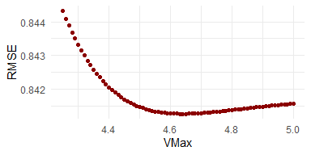

RMSE vs VMax

Using a maximum value of 4.64, we can continue and determine the minimum
value which will give us the best RMSE is 0.93 :

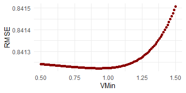

RMSE vs VMin

We now have an RMSE of **0.8412219**.

# Final Test

We now apply the latest prediction algorithm to the final\_holdout\_test
data set.

## Join the bias terms

    final_holdout_test_movies <- final_holdout_test_movies %>%
      left_join(b_v, by = c("movieId", "t_year")) %>%
      mutate(b_v = replace_na(b_v, 0))

    final_holdout_test_movies <- final_holdout_test_movies %>%
      left_join(b_w, by = c("userId", "t_year")) %>%
      mutate(b_w = replace_na(b_w, 0))

    final_holdout_test_movies <- final_holdout_test_movies %>%
      left_join(b_x, by = c("t_year", "year", "title")) %>%
      mutate(b_x = replace_na(b_x, 0))

## Compute the predictions

The predicted rating is the global mean (*μ*) plus the three bias
components. The result is then clamped to the admissible rating range
(0.93 – 4.64).

    final_holdout_test_movies$pred <- pmin(pmax(mu +
                                                  final_holdout_test_movies$b_v +
                                                  final_holdout_test_movies$b_w +
                                                  final_holdout_test_movies$b_x, 0.93), 4.64)

## Evaluate the model

The Root Mean Squared Error (RMSE) is computed by comparing the observed
ratings with the predicted values.

    RMSE(final_holdout_test_movies$rating, final_holdout_test_movies$pred)

The final RMSE obtained on the hold‑out test set is **0.8579873**.

# Conclusion

We achieved our target, obtaining an RMSE of **0.857987**, which is
lower than the required maximum of **0.86490**.

To reach this result we experimented with several bias‑based methods and
selected the combination that performed best on the validation data.

Further improvements are possible. The distribution of ratings in the
training set is not perfectly normal because a subset of users
consistently give half‑star ratings. If we separate the data into
half‑mark and full‑mark subsets, each subset approximates a normal
distribution.

A promising next step would be a two‑stage modeling approach:

Stage 1 – Classification: Predict whether a user will assign a half‑mark
or a full mark to a given movie. This binary decision could be modeled
with logistic regression, a tree‑based classifier, or any suitable
machine‑learning algorithm.

Stage 2 – Regression: Apply separate bias‑adjusted regression formulas
for the two groups (one for half‑marks, another for full marks). Each
regression would use the appropriate bias terms (movie, user, time,
etc.) tailored to that subgroup.

By first determining the likely rating granularity and then applying a
specialized regression model, we expect to reduce prediction error
further.
